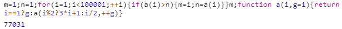
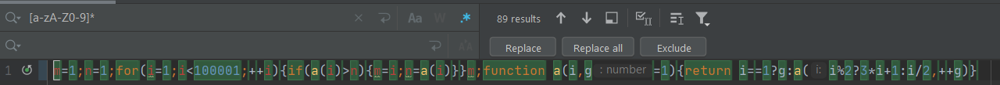

# Problema 1: Conjetura de Collatz
* Resultado: 77031
* Caracteres: 92

How to use:
* Abres una ventana de Chrome.
* F12 y buscas la Console
* Pegas el código que hay en el archivo SOLUTION.ts
* Le das a intro

> En la carpeta ALG se encuentra el código extendido y comentado en JavaScript y Python
>del algoritmo utilizado par resolver el problema.

> PD: Puede que no sea el más corto pero no puedes negar que original es. 

Víctor Tomàs.
